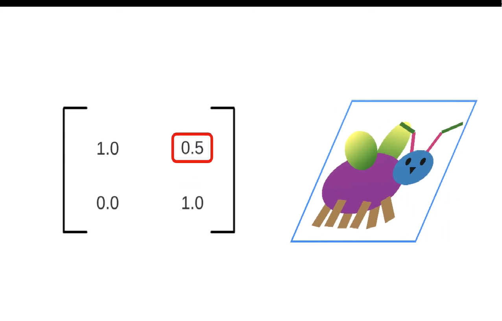
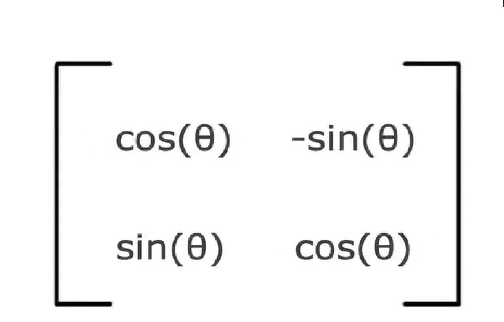
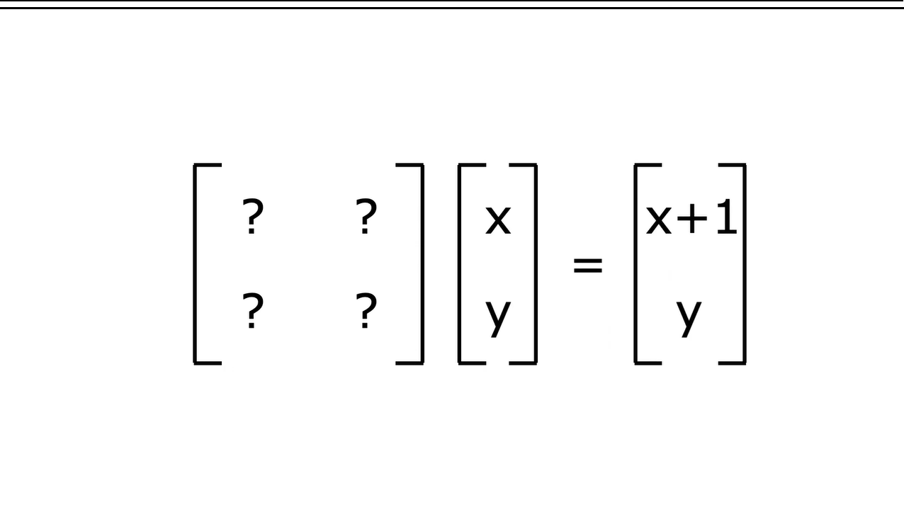
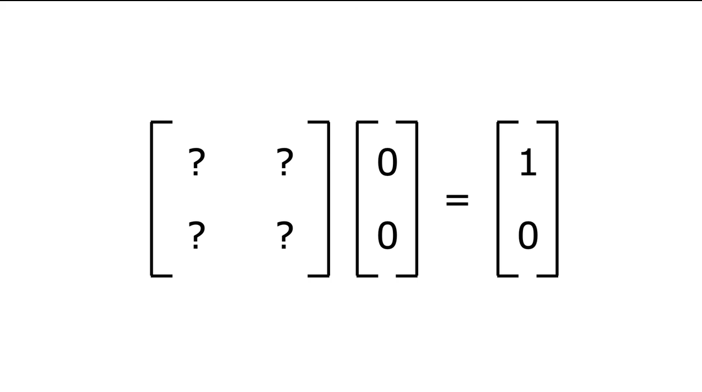
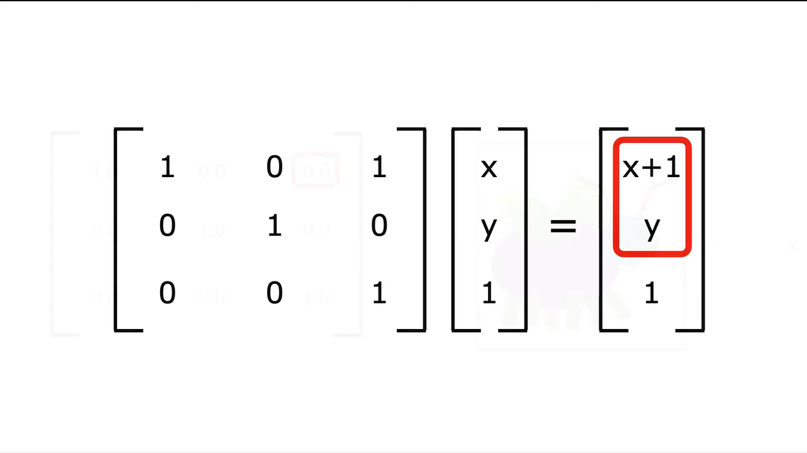
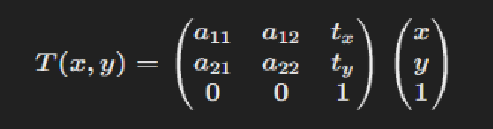
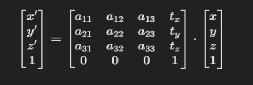
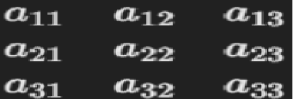
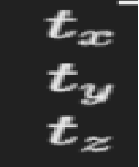

# Affine Transformation trong Game Development (Unity)

## Tổng Quan
Phép biến đổi Affine là một khái niệm toán học được sử dụng rộng rãi trong đồ họa máy tính và 
phát triển game để thao tác với vị trí, kích thước và hướng của các đối tượng trong không gian. 
Các phép biến đổi này bảo toàn tính song song giữa các đường thẳng, nghĩa là nếu hai đường 
thẳng song song trước khi biến đổi, chúng sẽ vẫn song song sau biến đổi. Phép biến đổi Affine 
kết hợp các phép biến đổi tuyến tính (quay, tỉ lệ, shear) và dịch chuyển (translation).

## Các Tính Chất Của Phép Biến Đổi Affine:
- **Dịch chuyển (Translation)**: Di chuyển đối tượng từ vị trí này sang vị trí khác.
- **Tỉ lệ (Scaling)**: Thay đổi kích thước của đối tượng.
- **Quay (Rotation)**: Xoay đối tượng quanh một điểm hoặc trục.
- **Nghiêng (Shear)**: Làm nghiêng đối tượng, biến dạng nó dọc theo trục X hoặc Y.

### Nghiêng (Shear)
Không sử dụng trực tiếp trong Unity, nhưng có thể thực hiện bằng cách sử dụng ma trận biến đổi 3x3.
Tuy nhiên, bạn có thể mô phỏng hiệu ứng shear bằng cách kết hợp các phép biến đổi hiện có. 
í dụ, nếu bạn muốn tạo ra một hiệu ứng shear, bạn có thể thay đổi kích thước theo một trục trong khi 
dịch chuyển các điểm khác theo hướng khác. Nhưng điều này thường phức tạp và không trực tiếp như 
các phép biến đổi cơ bản mà Unity hỗ trợ.
Nếu bạn cần tạo hiệu ứng shear, bạn cũng có thể thực hiện điều này thông qua shader hoặc các phép biến đổi tùy chỉnh trong mã của bạn.
<div style="text-align: center;">
    
    <p>Mô tả về hiệu ứng nghiêng theo trục x</p>
</div>

### Quay (Rotation)
## Làm cách nào từ ma trận biến đổi có thể quay một vật trong không gian?
<div style="text-align: center;">
    
    <p>Làm thế nào để xoay</p>
</div>
Ta thực hiện nghiêng đồng thời trục x và y theo chiều đối ngược nhau với cùng 1 độ lớn với việc sử dụng
hàm sin(góc đầu vào) để có được độ nghiêng. Nhưng chỉ làm điều này sẽ khiến kích thước của vật thể 
thay đổi, để giữ nguyên kích thước ta cần thực hiện một phép biến đổi nữa là tỉ lệ với hệ số là 
cos(góc đầu vào) để giữ nguyên kích thước của vật thể. Kết hợp 2 phép biến đổi này ta sẽ có được
một vật thể đã được quay mà không thay đổi kích thước.
Ta có một ma trận quay như sau:
<div style="text-align: center;">
    
    <p>Ma trận quay</p>
</div>
<div style="text-align: center;">
    
    <p>Xoay một vật thể</p>
</div>

````
Sử dụng phương thức Rotate() để xoay một GameObject quanh một trục cụ thể.
transform.Rotate(new Vector3(0, 90, 0));  // Xoay đối tượng 90 độ quanh trục Y
````

### Tỉ Lệ (Scaling)
````
Sử dụng thuộc tính localScale để thay đổi kích thước của một GameObject.
transform.localScale = new Vector3(2, 2, 0);  // Tăng gấp đôi kích thước đối tượng trên các trục
````

### Tương tự với 3D

<div style="text-align: center;">
    
    <p>3D Transformation</p>
</div>

### Ví Dụ: Kết Hợp Các Phép Biến Đổi
Bạn có thể kết hợp dịch chuyển, quay và tỉ lệ để tạo ra các phép biến đổi phức tạp:
````
// Di chuyển đối tượng 2 đơn vị trên trục X, xoay 45 độ và tăng gấp đôi kích thước
transform.Translate(new Vector3(2, 0, 0));
transform.Rotate(new Vector3(0, 45, 0));
transform.localScale = new Vector3(2, 2, 2);
````
### Nhưng làm thế nào để di chuyển trong hàm Translate ta mới chỉ có thể rotate và scale với ma trận 2x2?
Ma trận 2x2 đối với không gian 2 chiều chỉ giúp ta xoay và scale mà không thể dịch chuyển vật thể.

<div style="text-align: center;">
    
</div>
<div style="text-align: center;">
    
    <p>Dịch chuyển vị trí từ (0,0) sang (1,0) là không thể vì ma trận 0 nhân bất kỳ đều thành 0</p>
</div>
Ta cần thêm một hàng và một cột để có thể dịch chuyển vật thể.
Chúng có thể được biểu diễn dưới dạng ma trận 3x3 cho phép biến đổi 2D và tương tự ma trận 4x4 
cho phép biến đổi 3D.
<div style="text-align: center;">
    
    <p>Dịch chuyển vị trí từ (0,0) sang (1,0) bây giờ là có thể</p>
</div>

#### Nhưng ở hàng 1 cột 3 trong không gian 3 chiều là phép shear mà hãy xem tại sao ta áp dụng đc?

<div style="text-align: center;">
    
</div>

### Công thức biến đổi Affine trong không gian 2D:

### Công thức biến đổi Affine trong không gian 3D:


Trong đó:
- \(x, y, z\) là tọa độ ban đầu của điểm trong không gian 3D.
- \(x', y', z'\) là tọa độ mới của điểm sau khi áp dụng phép biến đổi affine.
- \(a[i][j]) là các phần tử của ma trận 3x3 đại diện cho các phép biến đổi tuyến tính (tỉ lệ, quay, shear).
- \(t_x, t_y, t_z\) là các thành phần dịch chuyển dọc theo các trục \(x\), \(y\), \(z\).

#### Giải Thích

<p><strong>Ma trận 3x3</strong> : chứa các phép biến đổi tuyến tính như tỉ lệ (scaling), quay (rotation), và shear (nghiêng).
  
</p>

<p><strong>Vector dịch chuyển</strong> : mô tả sự dịch chuyển của đối tượng trong không gian 3D.
<br>
  
</p>

## Kết Luận

Phép biến đổi Affine là nền tảng quan trọng để thao tác với các đối tượng trong không gian 2D và 
3D trong phát triển game. Unity cung cấp các phương thức sẵn có để dễ dàng áp dụng các phép biến 
đổi này, giúp lập trình viên điều khiển vị trí, quay, tỉ lệ của đối tượng một cách đơn giản và 
hiệu quả. 

### VỀ CƠ BẢN LÀ PHÉP NHÂN MA TRẬN CỦA TỌA ĐỘ ĐIỂM VỚI MA TRẬN BIẾN ĐỔI ĐỂ ĐƯỢC TỌA ĐỘ ĐIỂM MỚI SAU KHI BIẾN ĐỔI!!!