# Đề tài: Projection

### Sơ lược về Projection(Phép chiếu)

- Projection: Phép chiếu là cách mà một đối tượng được chiếu lên hay hiển thị lên trên mặt phẳng 2D.
- Projection đóng vai trò gì trong game:
  - Projection được sử dụng để chuyển đối tượng trong không gian 3D của game thông qua Camera thành hình ảnh 2D và hiển thị lên trên màn hình người chơi.
  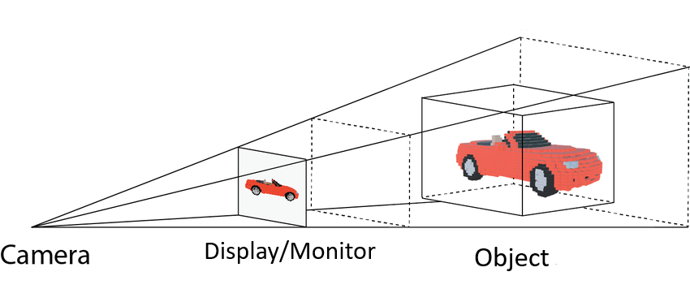
- Cách Projection hoạt động trong game, ứng dụng đồ họa 3D và các loại đồ họa máy tính:
  - Trước khi đi sâu vào những gì mà Projection làm, ta cần biết những mô hình 3D hay 2D trong game có cấu tạo như nào và những Space(Không gian) ở trong thế giới của Game.
  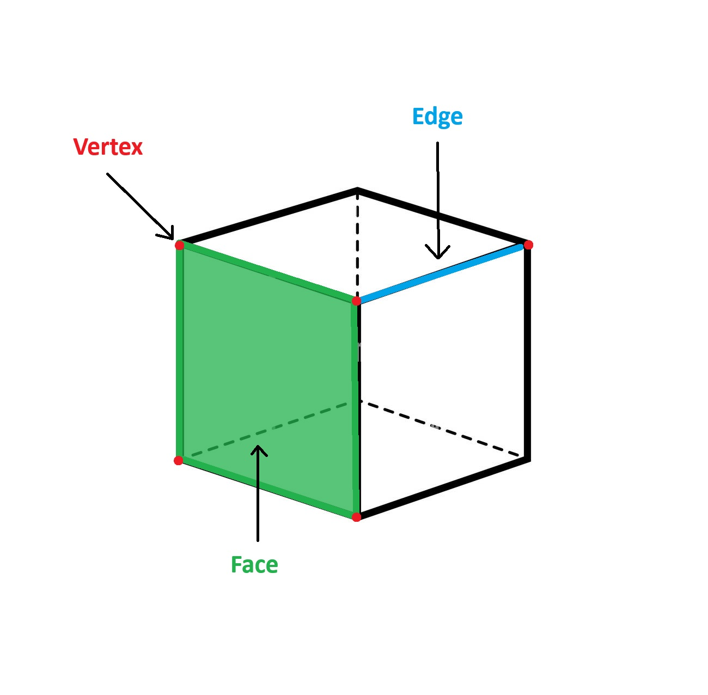
  
  - Cấu tạo mô hình 3D và 2D: Mô hình 3D hay các mặt phẳng 2D trong game đều được cấu tạo từ các Vertex (Đỉnh), 2 Vertex tạo thành một Edge (Cạnh), 3 Vertex trở lên tạo thành một Face(Mặt) hay Polygon(Đa giác), nhiều Polygon thì tạo thành một 3D Model (mô hình 3D), đối với game 2D thì mỗi vật thể từ nhân vật đến đồ vật xung quanh đều là những Face không có chiều sâu(Trục z) hay còn được gọi là Sprite.
  - Pivot Point: Mỗi mô hình đều tồn tại một Pivot Point(Điểm tựa) hay Origin Point(Điểm gốc), điểm này quyết định vị trí của mô hình trong World Space(Không gian thế giới) và đồng thời nó cũng được tính là gốc tọa độ (0, 0, 0) của mô hình, tất cả các Vertex của mô hình đều mang tọa độ trong Object Space (Local Space - Model Space - Không gian đối tượng) được tính từ vị trí của Pivot Point.
  - Các loại Space:
    - World Space: Không gian thế giới là nơi mà 
  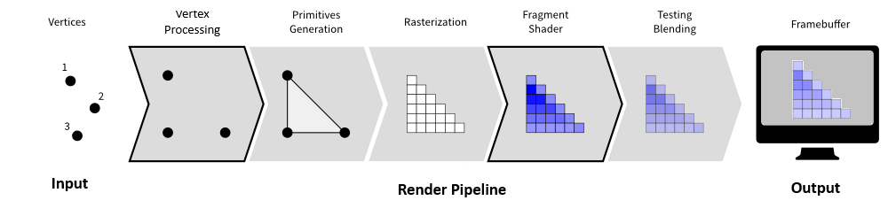
  - Vị trí của Projection: Projection là một phần của Render Pipeline (Quá trình kết xuất hình ảnh - nôm na là biến đổi tất cả những thứ mà Camera nhìn thấy thành hình ảnh 2D), chủ yếu tham gia vào bước Vertex Processing (Xử lí đỉnh).
  
  - Vertex Processing: Xử lý đỉnh là quá trình 
  - Vai trò Projecting trong Vertex Processing: Projection thực hiện chức năng chuyển đổi tọa độ của các Vertex của đối tượng từ 3D sang 2D, những Vertex được lựa chọn để chuyển đổi là những Vertex nằm trong View Frustum (Phần nhìn chóp cụt - Phần mà Camera nhìn thấy) của Camera. 
  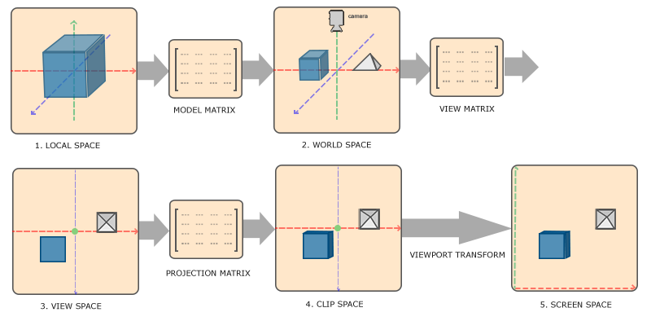
  - Projection Transformation(Biến đổi phép chiếu): Đây là lúc mà Projection vào việc sau sự chuẩn bị của quá trình Model Transformaiton và View Transformation - quá trình chuyển đổi tọa độ của các Vertex nằm trong View Frustum từ Object Space sang View Space.
  - Có 2 loại phép chiếu chính được dùng tùy vào mục đích của người sử dụng đó là 
    - Orthographic Projection (Phép chiếu vuông góc)
    - Perspective Projection (Phép chiếu phối cảnh)
  - Mục tiêu cụ thể của Projection Transformation là chuyển đổi tọa độ của Vertex thành tọa độ của các Pixel tương ứng trên màn hình.
    1. Chuyển tọa độ từ View Space sang Clip Space(Không gian trung gian giữa View Space và Normalized Device Coordinates(NDC) - Hệ tọa độ thiết bị chuẩn): bằng cách nhân tọa độ của Vertex với Projection Matrix(Ma trận chiếu - gồm 2 loại của lần lượt 2 phép chiếu).
    - Công thức: C = P x V
      - C: Ma trận tọa độ của Vertex trong Clip Space.  
      - P: Ma trận chiếu.
      - V: Ma trận tọa độ của Vertex trong View Space.
    2. Phép chia phối cảnh(Chỉ áp dụng với Perspective Projection): Chia lần lượt các tọa độ của Vertex cho w(Thành phần đồng nhất trong hệ tọa độ Homogenous(Đồng nhất), thường bằng 1) nhằm chuẩn hóa các tọa độ trong Clip Space.
    - Công thức: x' = x/w, y' = y/w, z' = z/w
    
    3. Cắt không gian(Clipping): Quá trình này diễn ra để loại bỏ các đối tượng hoặc một số phần của đối tượng nằm bên ngoài phạm vi hiển thị hay View Frustum nhằm đảm bảo chỉ có những Vertex nằm trong giới hạn mới được đến bước tiếp theo.
    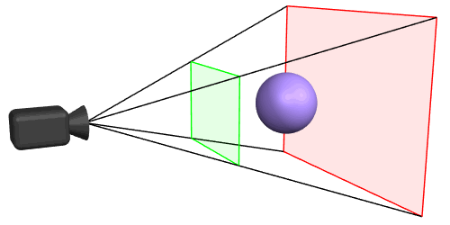
    4. Chuyển đổi khung nhìn(Viewport Transformation): Sau khi Clipping thì chuẩn hóa các tọa độ từ Clip Space sang NDC nhằm giới hạn các tọa độ trong giới hạn [-1, 1], tiếp đến là chiếu tọa độ lên các Pixel tương ứng trên màn hình và kết thúc công việc của Projection.
    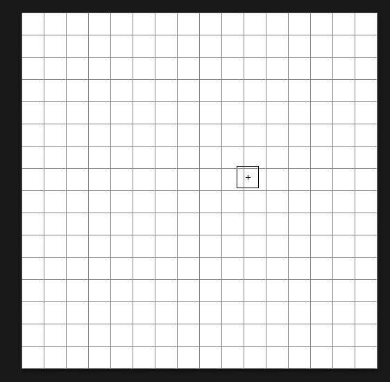
## Orthographic Projection
- Orthographic Projection: Phép chiếu trực giao là phép chiếu giữ cho kích thước của đối tượng không thay đổi bất kể khoảng cách đối với Camera.
- View Frustum của Orthographic Projection có dạng hình hộp chữ nhật kéo dài, vì tính chất giữ nguyên kích thước của mình, Orthographic Projection thường được dùng trong các Game 2D, các bản vẽ kĩ thuật(Bản thiết kế nhà cửa, máy móc) hay các phần mềm thiết kế kĩ thuật 3D(Vd: AutoCAD, SketchUp,...) nhằm tăng sự trực quan, dễ nhìn và độ chính xác, dù vậy cũng không ít tựa Game 3D sử dụng Orthographic Projection để cho ra kích thước chính xác, một góc nhìn bao quát lên khung cảnh và vật thể trong Game.
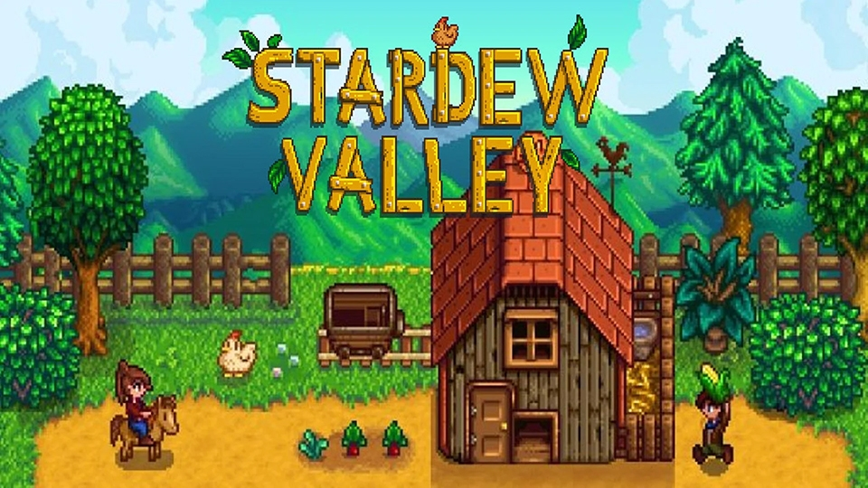
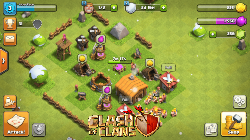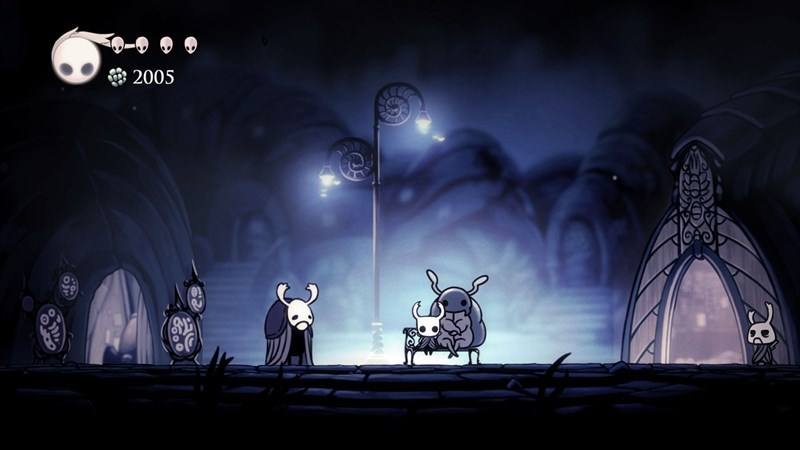
## Perspective Projection
- Perspective Projection: Phép chiếu phối cảnh là phép chiếu mô phỏng cách mà mắt người nhìn thế giới, đối tượng càng gần thì càng to, càng xa thì càng nhỏ.
- View Frustum của Perspective Projection có dạng hình chóp cụt đúng như tên gọi, đúng như tính chất mô phỏng cách mà đôi mắt con người nhìn thế giới, Perspective Projection lại ngược lại so với Orthographic Projection, được sử dụng rộng rãi trong các tựa Game 3D, các phần mềm đồ họa 3D(Vd: Blender, Maya, ZBrush,...), nhờ tính chất đấy mà trải nghiệm về phần nhìn Perspective Projection đem lại có cảm giác chân thực, có chiều sâu trong không gian và các đối tượng của Game.

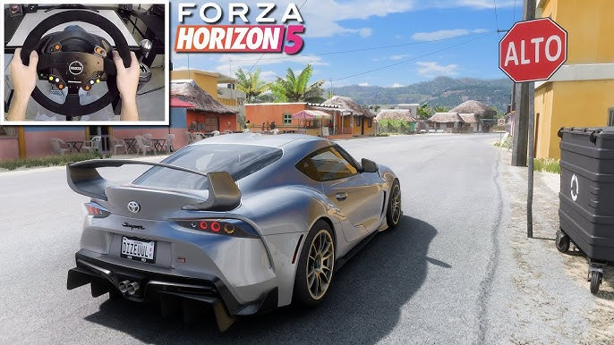

## Projection trong Unity
- Hiện nay, Camera trong Unity đã hỗ trợ cả 2 loại Perspective Projection và Orthographic Projection, người dùng có thể dễ dàng sử dụng và tiếp cận mà không cần lo về quá trình mà Projection cần thực hiện.

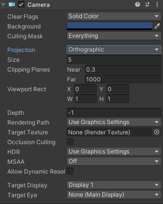
