<h1>Geometry (Hình học) trong phát triển Game</h1>

<h2>1. Các khái niệm cơ bản về hình học</h2>
<h3>1.1. Các dạng hình học cơ bản</h3>

<b>Điểm: </b>Điểm không có hình dạng và kích thước, mang các thông số để biểu diễn một vị trí cụ thể trong không gian. 

<b>Đường thẳng: </b> Đường thẳng được tạo thành bằng cách nối các điểm thẳng hàng trên cùng một mặt phẳng, kéo dài vô hạn về hai phía. 

<b>Đoạn thẳng: </b>Đoạn thẳng giới hạn bởi hai điểm đầu cuối, không kéo dài vô hạn

<b>Tia: </b>Tia bị giới hạn tại một đầu và kéo dài vô hạn về phía còn lại

<b>Mặt phẳng: </b>Mặt phẳng là một bề mặt phẳng hai chiều kéo dài vô hạn. 

<b>Mặt phẳng: </b>Mặt phẳng là một bề mặt kéo dài vô tận về 2 chiều. 

<b>Đa giác: </b>Đa giác là hình khép kín được tạo thành từ tối thiểu ba điểm. Đường nối giữa các điểm được gọi là cạnh của đa giác.

<h3>1.2. Hệ tọa độ Descartes</h3>

Tọa độ Descartes bao gồm các trục x, y trong không gian hai chiều và các trục x, y, z trong không gian ba chiều.

Trục đỏ: Trục x, Trục xanh lá: Trục y, Trục xanh dương: Trục z

  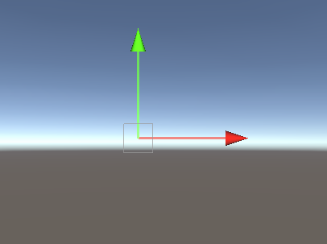

  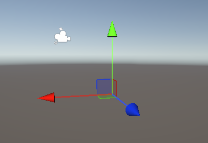

Trong Unity, tất cả các Object đều có Component Transform giúp người dùng lưu trữ và thao tác với vị trí, xoay Object và điều chỉnh kích thước của Object

  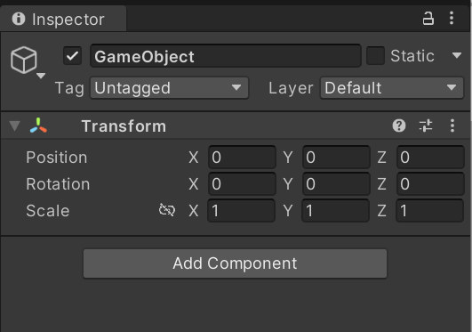

<b>Khoảng cách giữa hai điểm trong không gian: </b>

<h2>2. Hình học lượng giác</h2>
<h3>2.1. Các hàm lượng giác</h2>

Trong quá trình phát triển trò chơi, có rất nhiều tình huống bạn cần sử dụng các hàm lượng giác.
Các hàm được sử dụng để tính góc của một tam giác có một góc bằng 90 độ. Bằng cách chuyển đổi
phương trình, cũng có thể tính được cạnh của một tam giác khi biết một góc cho trước.
Những tính toán này cũng có ích đối với hình tròn. 

Xét tam giác ABC vuông tại A với một góc nhọn &alpha;, các hàm lượng giác trên góc &alpha; sẽ được tính toán như sau: 

  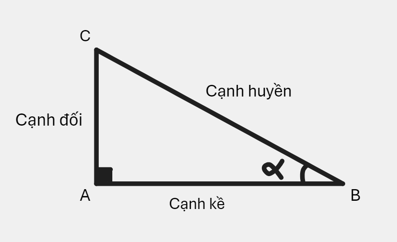

<b>Sin(&alpha;) = </b>Cạnh đối / Cạnh huyền = AC / BC

<b>Cos(&alpha;) = </b>Cạnh kề / Cạnh huyền = AB / BC

<b>Tan(&alpha;) = </b>Cạnh đối / Cạnh kề = AC / AB

<b>Cotg(&alpha;) = </b>Cạnh kề / Cạnh đối = AB / AC

<h3>2.2. Hệ tọa độ cực</h3>

Trong toán học, hệ tọa độ cực dùng để mô tả vị trí của một điểm trong không gian hai chiều, bao gồm các thành phần chính: 

  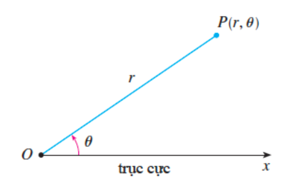

<b>Điểm cực (O): </b>Điểm này tương ứng với gốc tọa độ trong tọa độ Descartes

<b>Trục cực (O): </b>Trục cực thường được vẽ nằm ngang về phía bên phải tương ứng với trục Ox dương trong tọa độ Descartes

<b>Tọa độ cực(r, &phi;): </b>Gọi P là một điểm bất kì nằm trong mặt phẳng, cho r là khoảng cách từ O đến P và &phi; là góc giữa trục cực và đường thẳng OP. Điểm P được biểu diễn bởi cặp số (r, &phi;) gọi là tọa độ cực của P

Quy ước: Chiều dương ngược chiều kim đồng hồ. 

<h3>2.3. Chuyển đổi giữa tọa độ cực và tọa độ Descartes</h3>
<h4>Chuyển đổi từ tọa độ cực sang tọa độ Descartes</h4>

Các tọa độ cực có thể được chuyển đổi sang hệ tọa độ Descartes thông qua các hàm lượng giác Sin và Cos. 

Xét điểm P(x,y) trong tọa độ cực, bán kính r và góc quay &phi;, tọa độ của điểm P trong hệ tọa độ Descartes sẽ được tính toán như dưới đây: 

<b>x = rcos(&phi;)</b>  
<b>y = rsin(&phi;)</b>  

<h4>Chuyển đổi từ tọa độ Descartes sang tọa độ cực</h4>

Xét điểm P(x,y) trong tọa độ Descartes, bán kính r và góc quay &phi; sẽ được tính toán như dưới đây: 
 

  

  

Trong đó Atan2 là một biến thể của hàm tan được tính toán như dưới đây: 

  

  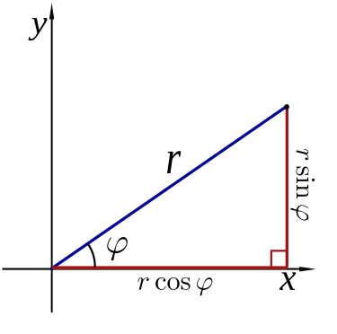

Mối quan hệ giữa tọa độ cực và tọa độ Descartes

Trong Unity hỗ trợ tính toán Atan2 bằng phương thức Mathf.Atan2

<h3>2.4. Ứng dụng</h3>
<h4>Quay vật thể theo vị trí của chuột</h4>

Vấn đề: Nhân vật trong trò chơi của bạn có thể xoay theo hướng của con trỏ chuột để hướng về phía kẻ địch và tấn công.

Đầu tiên, lấy ra điểm M(xM, yM) là tọa độ của con trỏ chuột. 

Tiếp theo, tính toán góc quay dưạ vào quan hệ giữa tọa độ cực và tọa độ Descartes đã được đưa ra ở trên. 

  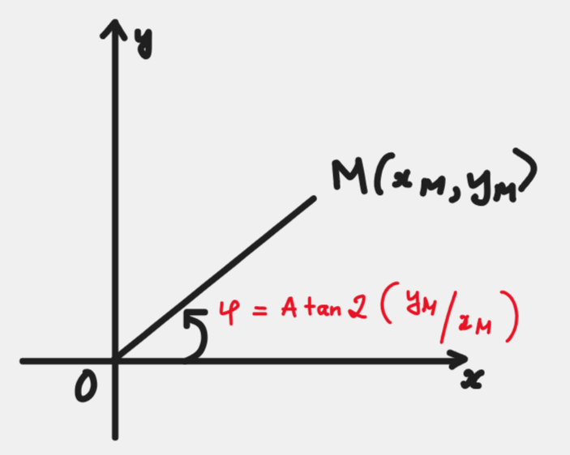

Cuối cùng, xoay người chơi theo góc vừa tính được.

Mã tham khảo: 

  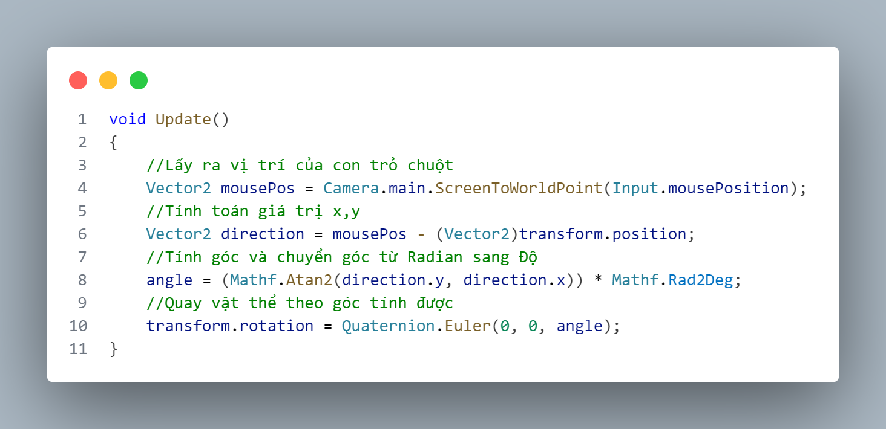

Kết quả: 

  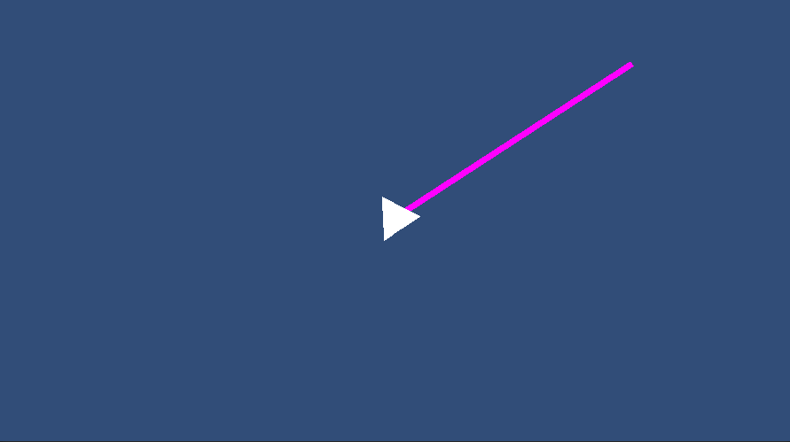

  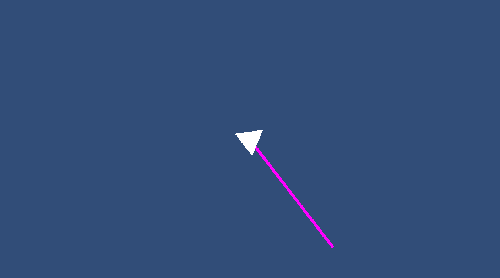

<h2>3. Các thuật toán về hình học và giao điểm</h2>
<h2>Các thuật toán phát hiện va chạm</h2>
<h3>Thuật toán AABB (Axis-aligned bounding boxes)</h3>

Cơ bản, thuật toán AABB sẽ bọc các vật thể bằng một khối hộp và kiểm tra vị trí của các hộp (Các hộp này phải đứng yên và không được xoay quanh các trục) này xem chúng có chồng lên nhau không. Ràng buộc các hộp không được quay xung quanh vì mục đích về hiệu suất. Phần diện tích tiếp xúc giữa hai khối hộp không xoay có thể được kiểm tra chỉ với các phép so sánh logic cơ bản, trong khi với khối hộp có thể xoay thì đòi hỏi các phép toán về lượng giác, chậm hơn khi tính toán.

<b>Kiểm tra một điểm có nằm trong AABB</b>

Giả sử Px, Py, Pz là tọa độ của điểm P đang xét, phạm vi của mỗi trục trong AABB lần lượt là các giá trị BminX - BmaxX, BminY - BmaxY, BminZ - BmaxZ, chúng ta có thể tính toán xem có xảy ra va chạm không dựa trên công thức: 

  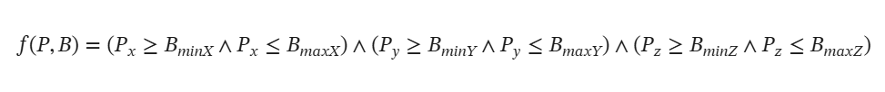

<b>Kiểm tra hai AABB có va chạm với nhau không</b>

Tương tự với kiểm tra trên điểm, chúng ta cần phải kiểm tra dựa trên mỗi trục, vẫn sử dụng phạm vi min - max của mỗi AABB.

  

Xét riêng trên trục x với hình ảnh trên, dựa vào vị trí của mỗi đối tượng sẽ tính toán lại các giá trị Min và Max thì hai AABB xảy ra va chạm khi maxX của hình màu xanh lớn hơn minX của hình màu hồng và minX của hình màu xanh nhỏ hơn maxX của hình màu hồng/p>

Xét trên hai trục y và z còn lại công thức sẽ như dưới đây: 

  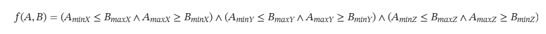

