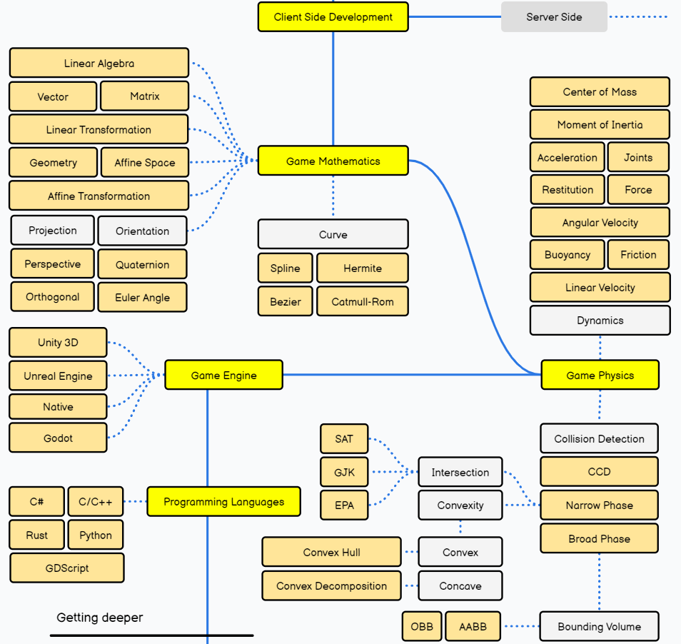
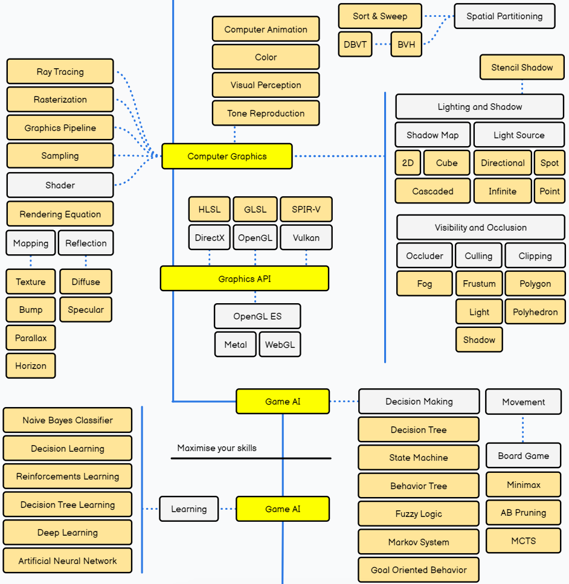
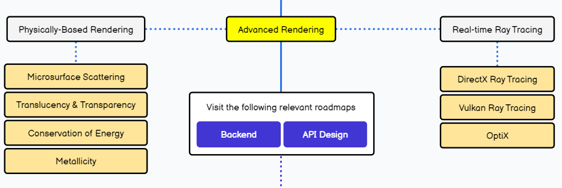

# Rule
Chỉ làm việc trên nhánh cá nhân
Sau khi push xong thì tạo pull request

Chỉ dùng 3 loại commit: 
- Add
- Modify
- Delete

# SFIT-GameDev-Roadmap
Repo này chứa kiến thức tìm hiểu được ở
<b><a href="https://roadmap.sh/game-developer"> roadmap này </a></b>

